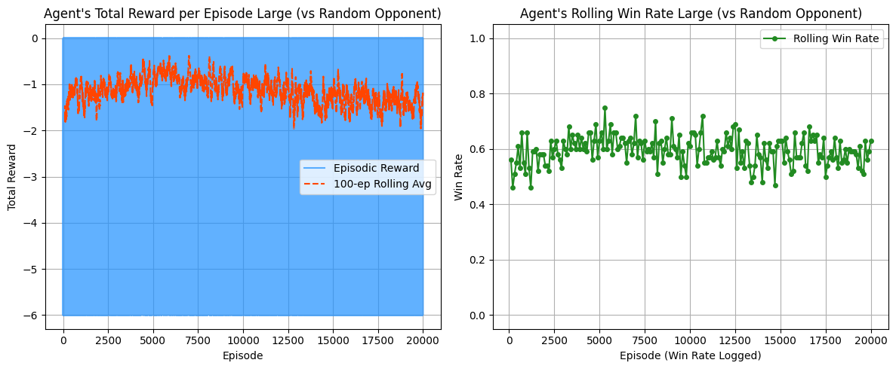
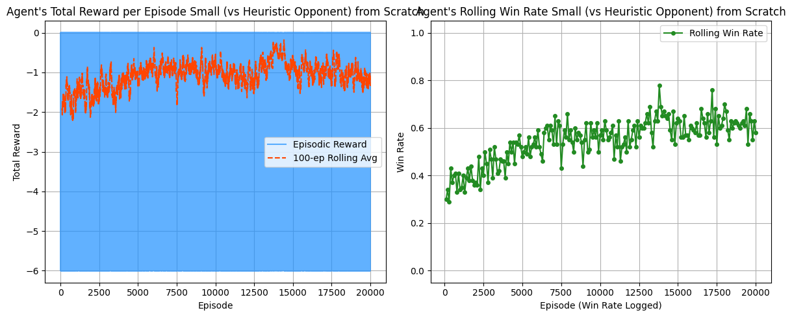
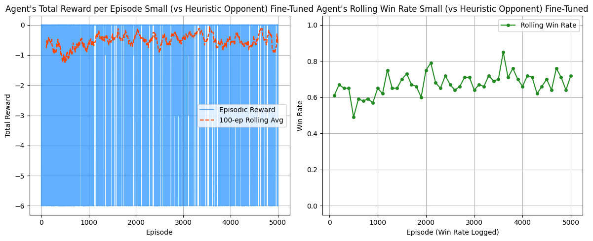

  
# Learning to play Air Land and Sea: A Reinforcement Learning Approach

Authors:
  Alex Kang, Andrew Kim, Daniel Xie

**Link to Presentation:**
<https://drive.google.com/file/d/1DkNuuRpufKBKAIgmScVmaYZfqv8QX-X0/view?usp=sharing>

## Keywords

Reinforcement Learning, Opponent Modeling, DQN, DDQN

# Original Plan

Our original plan for this project is to create a reinforcement learning
(RL) agent that can competently engage in the strategic card game Air,
Land, and Sea. We planned to utilize a Deep Q-Network approach. The goal
was to train an agent capable of playing Air, Land, and Sea
competitively by learning optimal strategies through self-play and
experience replay.\
We planned approaches such as:

- **Deep Q-Network (DQN):** Uses a neural network to estimate the
  optimal q-values for actions.

- **Belief State Modeling:** The agent could learn probability
  distributions over possible opponent hands based on observed moves.

To balance exploration and exploitation in training, we planned
strategies such as:

- **$\epsilon$-greedy strategy with decay:** Start with high exploration
  and gradually shift toward exploitation as training progresses.

- **Double DQN:** Mitigates overestimation bias, leading to more stable
  learning.

- **Opponent Modeling:** If time allows, we could explore methods like
  Bayesian inference or neural networks to predict opponent moves and
  improve decision-making.

For evaluation of our agent, planned pitting the bot against other
agents we will design. We intended to create a number of different
opponents using different strategies with increasing "skill" levels. As
a final test, we planned to play against the bot ourselves to determine
its strength against human opponents.

# Project Description

## Air, Land, and Sea Explanation

Air, Land, and Sea is a simple turn-based card game involving playing
cards over 3 "theaters" or boards played over multiple rounds where in
each round 2 players aim to have more points on a majority of the
theaters.

### Cards

There are 18 unique cards in the game. Each card has the following
attributes:

- **Type:** Each card has a type of Air, Land, or Sea. Cards can only be
  played face-up to their corresponding theater. For instance the air
  card: support can be played face-up to the air theater, but not the
  sea theater. Cards can be played face-down or "improvised" to any
  theater.

- **Strength/Point Value** Point values number from 1-6 and are used to
  determine the winner of a given theater. Improvised cards have a point
  value of 2.

- **Effect:** Some cards have an effect. These effects can be "instant"
  or "ongoing". Instant effects affect the board immediately after they
  are played, an example is the ability to move a player's card. Ongoing
  effects change the rules of the game, an example is making improvised
  cards worth 4 points instead of 2.

### Setup

The game starts with the 18 cards shuffled and 6 dealt to each player.
The turn order is swapped from the previous round (or determined if it
is the first round). The theater positions are rotated. The player who
is now first to move now takes their turn.

### Turns

On a player's turn they have the following options:

- **Play a card face-up:** A card can be played face-up to their
  corresponding theater and their effect activated if applicable

- **Play a card face-down:** A card can be played face-down to any
  theater and will be worth 2 points.

- **Withdraw:** A player can withdraw or forfeit from the round.

# Approach

## Game Engine

In designing the game engine to simulate Air, Land, and Sea we used the
OpenAI gym API as a reference to streamline training our model.\
Our engine handles the state of the game which constitutes the theaters
and their cards, players' hands and the effects currently active in the
game. Once the engine is passed a move, it will update the state of the
game according to the rules of Air, Land, and Sea.

### Observation State

The observation state is passed to the agent as a fixed‑length NumPy
array. This array encodes the current game state as seen by the agent
(the opponent's hand cards themselves are hidden). The agent uses this
as input to its policy/value network. The structure is:

- **Shape:** flat NumPy array of length `69`.

- **Features:**

  - **Agent's Hand (18 features):**

    - For each of the 6 hand slots:
      `(card_id, card_strength, card_type_value)`

    - Empty slots are encoded as `(-1, -1, -1)`.

  - **Opponent Hand Size (1 feature):** Number of cards in the
    opponent's hand.

  - **Theaters State (45 features):** For each of the 3 theaters (so: 15
    features \* 3):

  - **Battle Context (5 features)**

### Action Space

The action space contains the possible actions an agent can take in the
game. By design some of these actions will be invalid. The action space
is encoded by a set of fixed 37 `action_ids` each of which corresponding
to a possible action as follows:

- **Withdraw Action:** If a player takes this action they will withdraw
  from the round

- **Play Card Actions (36 types):**

  When a player plays a card there are three inputs to consider:

  - **Card Slot:** the corresponding slot in the player's hand the card
    is in

  - **Theater Index:** Which theater the card is to be played in

  - **Face-up or Face-down**

  These three inputs uniquely map to an action id in the current game
  state. Although some actions are invalid---such as playing a card
  face-up in a non-matching theater (with no effects allowing this), or
  playing a card from an empty slot in one's hand. The engine determines
  which moves are valid and creates a bitmask to be used on the q-value
  output vector of the model to discourage the agent from choosing these
  moves.

### Sub-Actions

To handle sub-actions (e.g. picking a card to flip after playing
maneuver) we reuse the same action space to denote the potential actions
the agent can take. Taking maneuver as an example, since our only choice
is to flip the top card of a pile, we really only have to pick an
adjacent theater to act upon and this will correspond to flipping the
top card at that theater. In this way we can have the engine map certain
`action_ids` to choosing different theaters. We use a similar idea for
all cards that require an additional action upon playing a card with an
instant effect.

### Reward Scheme

Our reward scheme will be designed to mimic the victory point structure
of the game where reward points will correspond to gaining/losing
victory points per round.

### Opponents

In order to train our model we employed 3 main opponents for our agent:

- **Random:** Would employ the strategy of playing a random valid move.
  With the limited action space, we hoped that this would provide a good
  starting difficulty for the model to play against without being too
  weak that it wouldn't learn anything.

- **Heuristic:** Using some basic strategies gathered from our
  experience playing the game. Examples include:

  - Play lowest value cards first

  - Play highest value cards first

  - Withdraw on turn X if losing 2 or more theaters

  - Following a given priority order for playing cards

- **Human Player:** Having played many games ourselves we aim to test
  our model against our skills.

We train the model using the following schemes and compare:

- Train against random only

- Train against heuristic only

- Train against random then train against heuristic

## Model: Deep Q-Network

To train our reinforcement learning (RL) agent for Air, Land, and Sea,
we implemented the Deep Q-Network (DQN) algorithm, a foundational method
in value-based RL (Mnih et al., 2015). DQN employs a neural network to
approximate the Q-function, enabling the agent to evaluate the expected
future reward of taking a given action in a given game state.\
We chose DQN because Air, Land, and Sea poses a moderate challenge in
both state and action complexity. While the action space is relatively
small, limited to a set of discrete moves available per turn, the state
space is combinatorially rich due to card values, theater positions,
turn number, and remaining hand composition. These intricacies make
function approximation through a neural network particularly effective.
Moreover, the game's clear episodic structure, where each match
represents a self-contained episode with a definitive start and
conclusion, aligns naturally with the episodic design of the DQN
framework.

### Model Architecture

We designed a lightweight neural network tailored to the compact but
expressive state representation of *Air, Land, and Sea*:

- **Architecture:** Three fully connected layers:

  - Layer 1: 128 hidden nodes

  - Layer 2: 128 hidden nodes

  - Output Layer: $|\mathcal{A}|$ outputs corresponding to the discrete
    action space

### Dynamic Action‐Space Adaptations

Unlike many classic RL benchmarks in which the set of legal moves is
fixed, *Air, Land, and Sea* features a dynamic action space: the list of
actions available to the agent changes from turn to turn as cards are
played and theaters are won or abandoned. This required several
adaptations to our DQN implementation:

1.  **Action Masking:** We encode only legal moves in the network's
    forward pass. Given the current hand and board, we construct an
    action mask $$\mathbf{m} \{{0,1\}}^{37}\$$

2.  **Persistent Index Mapping:** We maintain a mapping from each "card"
    to its global action ID. When a card is played, its ID is simply
    masked out; new IDs are never created mid‐episode, eliminating
    re‐indexing overhead.

3.  **$\epsilon$‑Greedy Sampling:** Sampling is performed *after*
    masking so the agent explores only among currently legal moves,
    preventing wasted exploration budget on illegal actions.

### Hyperparameters

We conducted a series of controlled experiments to tune key
hyperparameters that influence exploration and temporal credit
assignment:

- **Epsilon Decay:** Linearly decayed from 1.0 to 0.1 over the course of
  training to balance exploration and exploitation.

- **Episodes:** Varied between 5000 and 20,000 to identify saturation
  points and avoid overtraining.

- **Discount Factor ($\gamma$):** Set to 0.99 to prioritize long‑term
  strategic planning across multiple turns.

- **Learning Rate:** Initially set to $5\times10^{-5}$, with decay
  applied during fine‑tuning phases.

- **Batch Size:** 64 samples per gradient update.

- **Replay Buffer Size:** 100,000 transitions stored for experience
  replay.

### Regularization and Stabilization

To promote stable learning, we used the following techniques:

- **Target Network Update:** A separate target network is updated every
  fixed number of steps to stabilize temporal‐difference targets.

- **Experience Replay:** Transitions are sampled randomly from a replay
  buffer to break correlation and reduce variance.

- **Gradient Clipping:** Applied to prevent exploding gradients during
  updates.

### Training Procedures

Training was conducted in multiple stages, each intended to
progressively improve the agent's strategic reasoning:

- **Initial Training:** The agent was first trained against a random
  opponent, allowing it to learn basic value estimation and action
  selection.

- **Fine‑Tuning:** After baseline proficiency was established, the agent
  was fine‑tuned against a rule‑based heuristic player, which plays
  stronger, more consistent strategies.

Training performance was periodically evaluated by tracking win rates
against both random and heuristic opponents.

# Evaluation

## Evaluation Questions

Our project aimed to answer the following questions:

1.  How does the performance differ between a small DQN model and a
    larger DQN model?

2.  How does the choice of training opponent (random vs. heuristic)
    influence DQN performance?

3.  Does fine-tuning a pre-trained model on a heuristic opponent
    significantly improve performance compared to training from scratch?

## Experimental Setup

To answer these questions, we trained the following models:

**Model Architectures:**

- **Small DQN**: 2 hidden layers with 128 nodes each, ReLU activations.

- **Large DQN**: 3 hidden layers with sizes 256, 256, and 128 nodes
  respectively, ReLU activations.

**Training Conditions:**

- Small DQN trained from scratch against a random opponent.

- Large DQN trained from scratch against a random opponent.

- Small DQN trained from scratch against a heuristic opponent.

- Small DQN initially trained on random opponent and fine-tuned on a
  heuristic opponent.

## Results

### Performance of Small DQN Trained on Random Opponent

We trained the small DQN model from scratch against a random opponent
policy. The agent's average reward and win rate, showed consistent
improvement, plateauing slightly after approximately 10,000 episodes.

Final evaluation results (averaged over 500 episodes) were as follows:

- **Against Random Opponent**: Win Rate (Agent P0): $78.00\%$

- **Against Heuristic Opponent**: Win Rate (Agent P0): $64.40\%$

These results are promising, demonstrating that even when trained
against only a random opponent, the DQN agent was able to get a grasp of
the game, gradually improving its winrate as it played more.

### Performance of Large DQN Trained on Random Opponent

We trained the large DQN model from scratch against a random opponent
policy. Here, the agent's average reward and win rate did not
consistently improve as before; performance began to decline a bit after
approximately 5,000 episodes.

Final evaluation results (averaged over 500 episodes) were as follows:

- **Against Random Opponent**: Win Rate (Agent P0): $48.60\%$

- **Against Heuristic Opponent**: Win Rate (Agent P0): $23.40\%$

From past experience, these larger models usually perform worse than
their smaller counterparts on discrete strategy games such as this one.
The decrease in performance performance is likely due to overfitting, as
larger models may memorize narrow certain gameplay patterns instead of
learning more generally applicable strategies.

### Performance of Small DQN Trained on Heuristic Opponent

We trained the small DQN model from scratch directly against a heuristic
opponent policy. The agent's average reward and win rate improved
consistently, but plateaued slightly after about 15,000 episodes.

Final evaluation results (averaged over 500 episodes) were as follows:

- **Against Random Opponent**: Win Rate (Agent P0): $70.60\%$

- **Against Heuristic Opponent**: Win Rate (Agent P0): $56.00\%$

We were surprised to see that the heuristic-trained agent performed
worse than the random-trained agent. We had thought that the heuristic
opponent would play better quality moves thus improving our agent's
performance. We believe this decrease in performance is due to the fact
that the heuristic may have constrained the agent's strategic diversity,
limiting its ability to explore and generalize, compared to the more
varied scenarios presented by the random opponent.

### Performance of Small DQN Fine-Tuned on Heuristic Opponent

We fine-tuned the small DQN model, initially trained on a random
opponent, by further training it against a heuristic opponent policy.
The agent's average reward and win rate improved consistently and
plateaued slightly after around 3,500 episodes.

Final evaluation results (averaged over 500 episodes) were as follows:

- **Against Random Opponent**: Win Rate (Agent P0): $85.00\%$

- **Against Heuristic Opponent**: Win Rate (Agent P0): $72.40\%$

These results confirmed our prior expectations that fine-tuning would
produce the best performance. We believe this improvement comes from
combining the foundational general strategy learned from the random
opponent training with the strategic refinement provided by the
heuristic opponent.

## Game Analysis

We looked at some of the games our agent played against the heuristic
and uncovered some interested strategies it had learned:\
In one game, the agent demonstrated a good understanding of late-game
plays. In the round, it played around the opponent's containment card to
secure an early theater win. Following this it played its cover fire, a
card whose strength comes from its aspect of surprise, at the end to
clinch the win in the sea theater secure the round win.\
In another game, it utilized the ambush card to flip over its own
disrupt card to score 5 points instead of 2. This allowed it to take
control over the land theater, allowing it to eke out the round win.

## Conclusion

However, it's crucial to note that while the agent does beat the random
and heuristic opponents the majority of the time, the agent still does
not have a really concrete sense of logic within the game. It still
makes quite a few blunders from the perspective of an advanced player.\
One possible fix for this is to make a more complex heuristic opponent.
Currently, ours only plays cards with the highest point values; however,
it would be possible to make one that makes a move greedily based off of
the predicted points after each card is placed. That is, the heuristic
would make the best possible move after the effects. A more logical
training opponent would hopefully allow the agent to learn better.\
Overall, we are very satisfied with the output of our agent. Most of our
hypotheses had some validity, and we were able to create a bot that
learned basic strategy. However, if we were to take this project
further, it would be nice to try training with more advanced bots,
against itself, or against players. It was a very fun experience to dive
into reinforcement learning and especially apply to a card game we love.

# References

1.  Arcane Wonders. (2021). *Air, Land, and Sea (Revised Edition)
    Rulebook*. Retrieved from
    <https://boardgamegeek.com/filepage/226112/air-land-and-sea-revised-edition-rulebook>

2.  Mnih, V., Kavukcuoglu, K., Silver, D., Graves, A., Antonoglou, I.,
    Wierstra, D., & Riedmiller, M. (2013). *Playing Atari with Deep
    Reinforcement Learning*. arXiv preprint arXiv:1312.5602.
    <https://arxiv.org/abs/1312.5602>

3.  Van Hasselt, H., Guez, A., & Silver, D. (2015). *Deep Reinforcement
    Learning with Double Q-learning*. arXiv preprint arXiv:1509.06461.
    <https://arxiv.org/abs/1509.06461>

4.  Ioffe, S., & Szegedy, C. (2015). *Batch Normalization: Accelerating
    Deep Network Training by Reducing Internal Covariate Shift*. arXiv
    preprint arXiv:1502.03167. <https://arxiv.org/abs/1502.03167>

5.  Minton, S., & Jain, S. (2019). *RBED: Reward Based Epsilon Decay*.
    arXiv preprint arXiv:1910.13701. <https://arxiv.org/abs/1910.13701>
